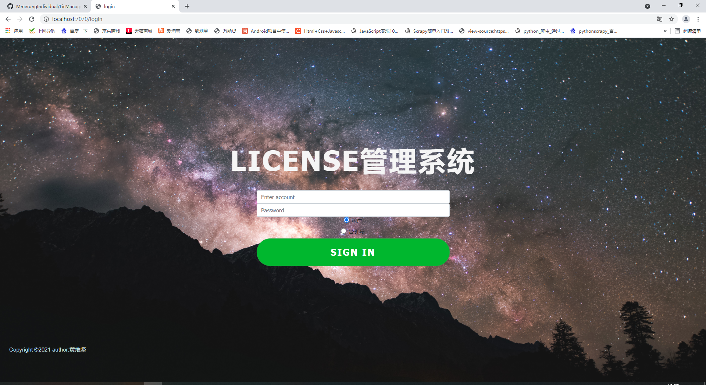
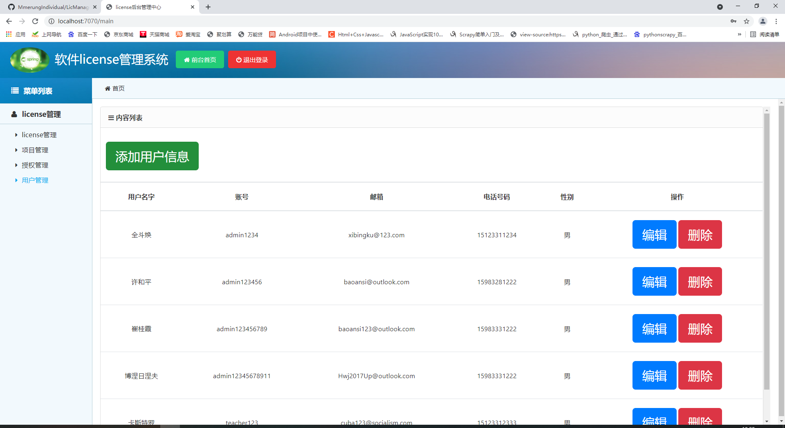

# LicManagement
## 性质：管理系统
基于springboot2编写的软件license管理系统，是我们学校想的一个很水的毕设题目，由于本人是个拖延症又对springboot不是很熟悉，所以导致项目进度十分缓慢。
## 目标
设计一个对付费软件的license资产进行管理的管理系统，由于本科阶段很拉，没有怎么用过springboot，所以如果有大佬看到的话，可以帮我看看代码，给我提点意见。
## 进度（截至2021/5/15）
基本完成，前端按ID查询接口未写，不写啦！
整合SpringSecurity（未完成）
学习vue.js(未完成)
## 拉垮展示
#### 登录界面（已经修改样式，如下所示）

登录地址：localhost:7070/login
登录账号：admin1234
登录密码：123456;其他数据表user里的account，password也可用
#### 管理系统界面（主界面,有改动，但大致相同）

## 结语
本科期间太拉了，写这个小项目都很费力，希望未来研究生阶段能有所进展吧。陌生人，希望你提出意见和你的star，谢谢！
